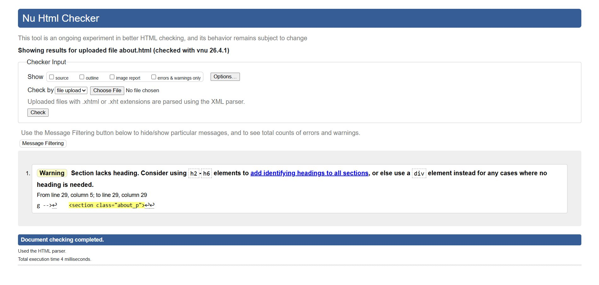
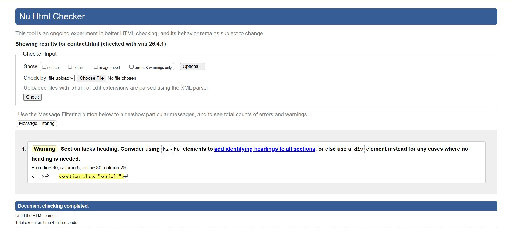
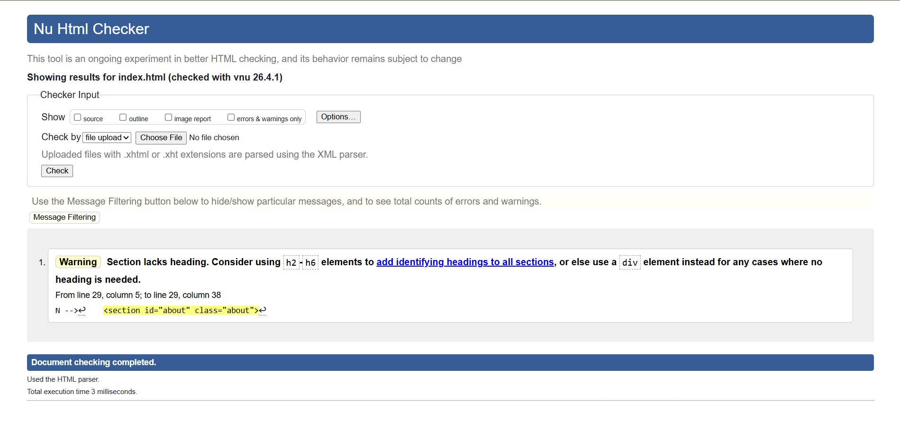
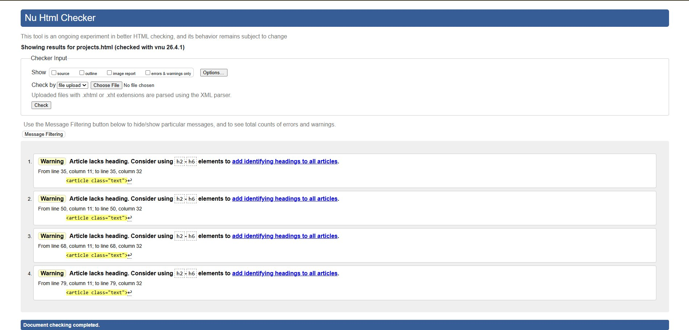
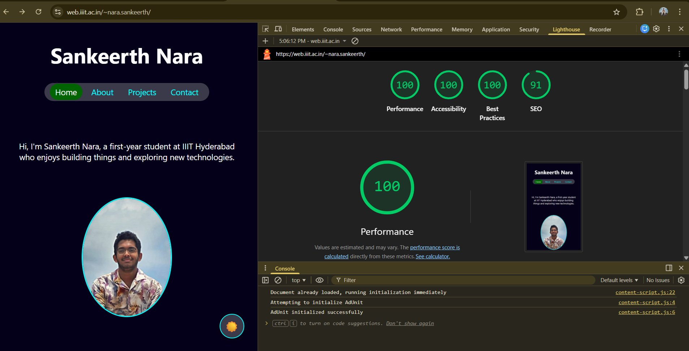
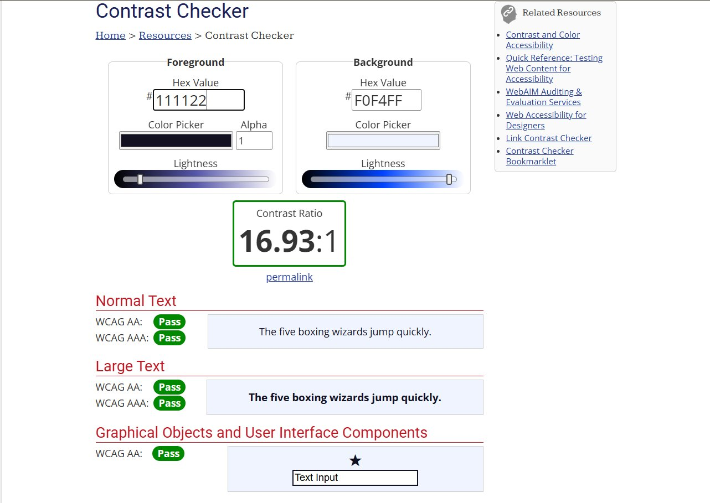
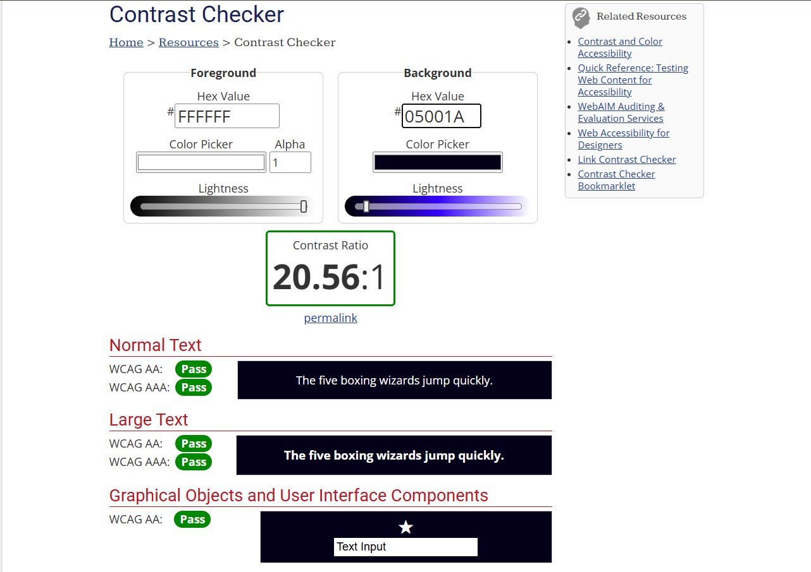

# Sankeerth Nara — Personal Portfolio

**Name:** Nara Lakshmi Sankeerth
**Roll Number:** 2025101133
**Live URL:** [https://web.iiit.ac.in/~nara.sankeerth/](https://web.iiit.ac.in/~nara.sankeerth/)

---

## § 01 — Group A Feature: Interactive Timeline / Accordion

**Feature chosen:** Accordion-style interactive timeline on the About page.

**Implementation approach:**
The timeline is built as an ordered list (`<ol>`) with each entry containing a `<button>` as the trigger and an `<article>` as the collapsible card. Accessibility is handled via `aria-expanded` and `aria-controls` attributes — the button announces its open/closed state to screen readers, and the card uses the native `hidden` attribute to truly remove it from the accessibility tree when collapsed. A small vanilla JS script in `about.js` listens for `click` events on each `.timeline-trigger` button, toggles `aria-expanded` between `"true"` and `"false"`, and sets `card.hidden` accordingly. A vertical guide line is drawn purely in CSS using a `::before` pseudo-element on the `<ol>`, and each dot is an absolutely positioned `` inside the trigger. A `popUpRight` keyframe animation plays on each card as it opens, giving the expansion a snappy, directional feel. No libraries or frameworks are used — the entire feature is semantic HTML + CSS + ~10 lines of JS.

---

## § 02 — Group B Feature: Contact Form / Modal Dialog

**Feature chosen:** Contact dialog launched from the Contact page.

**Implementation approach:**
The contact form is implemented using the native HTML `<dialog>` element, opened programmatically via `dialog.showModal()` in `contact.js`. Two buttons on the page (Personal Email and College Email) both call a shared `openDialog()` function that resets the form with `form.reset()` before showing the modal, ensuring no stale data from a previous submission is ever displayed. The Cancel button calls `dialog.close()`, and the form's `submit` event is intercepted with `e.preventDefault()` so the page never reloads — a confirmation `alert` is shown instead, then the dialog closes. The dialog is styled entirely with CSS variables so it automatically inherits both the dark and light themes. The `<dialog>` element provides built-in focus trapping and the `Escape`-key-to-close behaviour for free, making the implementation both accessible and concise.

---

## § 03 — Typographic Pairing

**Pairing:** [Inter](https://fonts.google.com/specimen/Inter) (body) + a humanist serif for headings (e.g. [Lora](https://fonts.google.com/specimen/Lora) or [Playfair Display](https://fonts.google.com/specimen/Playfair+Display))

**Justification:**
Inter is an exceptionally legible grotesque sans-serif designed specifically for screen readability at all sizes — it was the natural choice for body text, navigation, and UI elements where clarity matters most. Pairing it with a humanist serif for headings (`h1`, `h2`, `h3`) creates a deliberate contrast: the serif brings warmth, personality, and a sense of craft that offsets Inter's clean neutrality. This combination is widely used in editorial and portfolio design because it avoids the "all-sans" flatness that makes many developer portfolios feel generic, while still keeping the interface modern and legible. The contrast in stroke weight and character form between the two typefaces also reinforces the visual hierarchy — you can tell at a glance what is a heading and what is body copy without relying solely on size or colour.

---

## § 04 — Animation Justifications (D3)

| Animation | What it communicates |
|---|---|
| `popUp` (translateY + scale) | Used on project cards, contact buttons, and dialog — communicates that these elements are interactive objects "arriving" on the page, drawing the eye and implying they can be acted upon. |
| `popUpLeft` (translateX from left) | Used on the home page intro paragraph — communicates authorship and voice; the text slides in from the reading direction, mimicking the natural flow of reading and anchoring the viewer's attention to the words first. |
| `popUpRight` (translateX from right) | Used on the profile photo and timeline cards — communicates response and balance; the image "answers" the text that slid in from the left, and timeline cards feel like they are being revealed from inside the line. |
| Timeline card open animation | Communicates state change — when a user clicks a timeline trigger, the card's entrance animation confirms that something new has appeared, reducing cognitive load and making the accordion feel tactile rather than abrupt. |
| Hover transforms (scale + translateY) | Used on project cards, social icons, and the profile photo — communicates interactivity and affordance; the subtle lift signals "this element responds to you" without requiring any label or instruction. |
| Theme toggle button hover (rotate + scale) | Communicates playfulness and control — the rotation implies switching or turning, reinforcing the mental model of toggling between two states. |

---

## § 05 — Screenshots

### W3C HTML Validation

All four pages passed with **zero errors**. Only advisory warnings were raised (sections without headings — these are intentional layout sections that do not require headings semantically).

**about.html** — 1 warning, 0 errors

**contact.html** — 1 warning, 0 errors

**index.html** — 1 warning, 0 errors

**projects.html** — 4 warnings, 0 errors

---

### Lighthouse Audit Report

Scores on the live deployment: **Performance 100 · Accessibility 100 · Best Practices 100 · SEO 91**

---

### WCAG Contrast Check — Light Theme

Foreground `#111122` on background `#F0F4FF` → **Contrast Ratio 16.93:1**
Normal Text: WCAG AA ✅ WCAG AAA ✅ | Large Text: WCAG AA ✅ WCAG AAA ✅

---

### WCAG Contrast Check — Dark Theme

Foreground `#FFFFFF` on background `#05001A` → **Contrast Ratio 20.56:1**
Normal Text: WCAG AA ✅ WCAG AAA ✅ | Large Text: WCAG AA ✅ WCAG AAA ✅

---

## § 06 — Live Deployment

[https://web.iiit.ac.in/~nara.sankeerth/](https://web.iiit.ac.in/~nara.sankeerth/)
